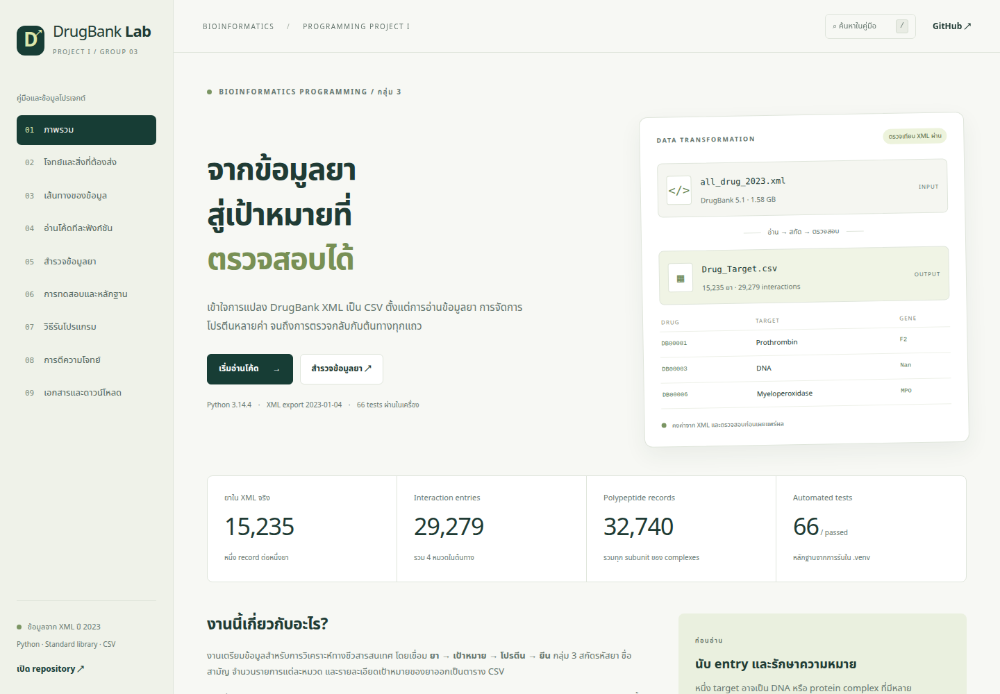

# Bioinformatics Programming Project I — กลุ่ม 3

โปรแกรมอ่าน **`all_drug_2023.xml` เป็นค่าเริ่มต้น** และสร้าง `Drug_Target.csv` ตามโจทย์หน้า 4
ตัวตรวจอิสระอ่าน XML ซ้ำและเทียบทุกแถวทุก cell พร้อมตัวอย่างต้น/กลาง/ท้าย
ใช้ Python 3.10 ขึ้นไปและ standard library; environment ที่เตรียมไว้คือ `.venv` (Python 3.14.4)

## เว็บไซต์คู่มือ GitHub Pages

เว็บไซต์มีคำอธิบายทุกฟังก์ชันของ parser/exporter/verifier และเครื่องมือเสริม พร้อม source และเลขบรรทัด
ค้นหายาจาก CSV จริงได้ครบ 15,235 ยา ดู protein entries ทุกหมวด รวม subunits ของ complexes
มีข้อกำหนดโจทย์ ผลทดสอบทั้ง 66 กรณี benchmark วิธีรัน และเอกสาร/ข้อมูลให้ดาวน์โหลด



URL หลังเปิด Pages: **https://phattharaphum.github.io/nb-BioinformaticsProgramming/**

การเปิดครั้งแรก: ไปที่ repository **Settings → Pages → Source: GitHub Actions**
แล้วเปิด **Actions → Build and deploy project website → Run workflow**
เมื่อ Pages เปิดแล้ว ทุก push ไป main จะ build ตรวจสอบ และ deploy ให้อัตโนมัติ
หากยังไม่เปิด Pages workflow จะ build และเก็บ artifact ไว้ โดยข้าม deploy พร้อมคำแนะนำใน Summary

ทดลองเว็บในเครื่อง:

```bash
.venv/bin/python tools/build_site.py
.venv/bin/python tools/check_site.py
.venv/bin/python -m http.server 8000 --directory site
```

เปิด http://localhost:8000/ (ต้องใช้ HTTP เพื่อให้ fetch ข้อมูลทำงาน)
แก้เนื้อหาใน `web/index.template.html`, คำอธิบายฟังก์ชันใน `web/content.json` และหน้าตา/พฤติกรรมใน `web/assets/`
โฟลเดอร์ `site/` เป็นผลที่สร้างใหม่ได้และไม่อยู่ใน Git อ่านรายละเอียดได้ใน [docs/website.md](docs/website.md)

ตรวจข้อมูลเว็บครบทุก cell 15,235 ยา/29,279 entries และ 618 complexes ผ่าน
การทดสอบ Chrome/Playwright ผ่าน 24 กรณี ทั้ง desktop/mobile/deep links/no-JS
หลักฐานอยู่ใน [browser results](docs/website_browser_results.json) และ [ภาพมือถือ](docs/website-mobile.png)

## วิธีรัน

```bash
source .venv/bin/activate
python group3.py
```

หรือรันโดยไม่ activate:

```bash
.venv/bin/python group3.py
```

ได้ `Drug_Target.csv` และ `Drug_Target.validation.json` หลังสกัดและตรวจสอบผ่าน
ทั้งโปรแกรมหลักและตัวตรวจใช้ XML เป็นค่าเริ่มต้น หาก XML หายจะรายงานข้อผิดพลาดและไม่มีการสลับไปใช้ TXT อัตโนมัติ

```bash
.venv/bin/python verify_output.py --report verification.json
.venv/bin/python group3.py --output Drug_Target_table.csv --layout table
.venv/bin/python -m unittest discover -v
```

การทดสอบล่าสุดผ่าน **66 กรณี** รวมการยืนยันว่า CLI เลือก XML แม้มี TXT อยู่ด้วย และไม่ fallback เมื่อ XML หาย

สร้าง environment ใหม่:

```bash
python3 -m venv .venv
.venv/bin/python -m pip install -r requirements.txt
```

ไม่มี package ภายนอกใน requirements.txt บน Windows ใช้ `.venv\Scripts\python.exe`
ระบุ XML ที่อยู่ตำแหน่งอื่นได้ด้วย `--input /path/to/all_drug_2023.xml`

## ข้อมูลและผลลัพธ์

XML จริงในโฟลเดอร์นี้มีขนาด 1,582,294,735 bytes และ root ระบุ `version="5.1"`, `exported-on="2023-01-04"`
ผลใน root สร้างจาก XML จริง ส่วน `examples/Drug_Target.csv` เป็นผล XML จำลองสำหรับชุดทดสอบ
ผล TXT เดิมเก็บใน `examples/text_recovery/` เพื่ออ้างอิง โดยไม่ใช้เป็นผลลัพธ์ปัจจุบัน

รายงาน validation เก็บ source/output SHA-256, จำนวนยา, counts รวมรายหมวด, จำนวน protein blocks สูงสุด
ตัวอย่าง expected/actual ต้น/กลาง/ท้าย และพาธ Python พร้อมสถานะ venv
`status=passed` หมายถึงค่าที่เขียนตรงกับ XML ตาม mapping ที่เปิดเผย
`specification_status=requires_ion_channel_definition` แยกข้อกำกวมของโจทย์ออกจากผลตรวจข้อมูล
ส่วน `xml_structure_audit` ตรวจจำนวน polypeptides และเก็บรายละเอียดทุก subunit ของทั้ง 618 complexes

## รูปแบบ CSV ตามโจทย์

6 คอลัมน์แรก:

```text
DrugBank_ID,Generic_Name,Total-Target,Total-Enzyme,Total-IonChannel,Total-Transporter
```

ใช้ `Total-IonChannel` ตาม header ในภาพ; ข้อความบรรยายสะกด `Total-IonChanel`

ตามด้วยชุดละ 6 คอลัมน์: `protein_number,protein_name,organism,actions,Uniprot_ID,gene_name`
ค่าเริ่มต้น `--layout assignment` คงวงเล็บเหลี่ยมตามภาพโจทย์ ตัวอย่าง:

```text
DB00001,Lepirudin,1,0,0,0,[1,Prothrombin,Humans,inhibitor,P00734,F2]
DB00003,Dornase alfa,1,0,0,0,[1,DNA,Humans,Nan,Nan,Nan]
DB00006,Bivalirudin,1,1,0,0,[1,Prothrombin,Humans,inhibitor,P00734,F2],[1,Myeloperoxidase,Humans,inhibitor,P05164,MPO]
```

หนึ่งชุดเป็น 6 CSV cells โดย `[` อยู่หน้า cell แรกและ `]` อยู่ท้าย cell สุดท้าย
header มีชุดเท่าจำนวน interaction entries สูงสุดของยาใด ๆ ใน XML; แถวไม่มี entries มี 6 cells
`--layout table` เป็นรูปแบบเสริม: ชื่อ header มี `(n)` ไม่ซ้ำ ไม่มีวงเล็บเหลี่ยม และเติม cells ว่างให้ทุกแถวเท่ากัน
เลข `(n)` ใน header ระบุตำแหน่งชุดคอลัมน์; ค่า protein_number ในข้อมูลเริ่มใหม่ทุกหมวด
ใช้ UTF-8 BOM และ csv.writer เพื่อรักษา comma, quote, newline และภาษาไทย

## วิธีสกัดและกรณีพิเศษ

| ข้อมูล | หลักการ |
|---|---|
| รหัสยา | เลือก primary DrugBank ID จากลูกโดยตรง; fallback เฉพาะ DB ID เดียวที่ไม่กำกวมและรายงานจำนวน |
| ชื่อสามัญ | name ของยาโดยตรง ไม่เลือกชื่อจาก pathway หรือ drug interaction |
| counts | นับ entries ใน targets, enzymes, carriers, transporters รวม non-protein เช่น DNA |
| ลำดับ | targets → enzymes → carriers → transporters; ภายในหมวดรักษาลำดับ XML |
| numbering | เริ่ม 1 ใหม่ทุกหมวดภายในแต่ละยา ตามภาพ Bivalirudin |
| ชื่อ/organism | ค่าระดับ entry ก่อน หากไม่มีจึงใช้ polypeptide |
| UniProt/gene | attribute id และ gene-name ของ polypeptide ไม่ใช้ BE ID เป็น UniProt |
| หลายค่า | คั่น actions และคู่ UniProt/gene ด้วย ` \| `; คง Nan ที่ตำแหน่งข้อมูลหาย |
| ไม่มีข้อมูล | counts เป็น 0; รายละเอียดที่ขาดเป็น Nan; ไม่ทิ้ง DNA หรือ entry ที่ไม่มี polypeptide |
| โปรตีนหลายบทบาท | ไม่ deduplicate เพื่อรักษาทุก interaction entry |

**จุดกำกวม:** `Total-IonChannel` ใน PDF ไม่ตรงชื่อหมวด XML มาตรฐาน
โปรแกรมใช้ `<carriers>/<carrier>` สำหรับคอลัมน์นี้ตามสมมติฐานการจับคู่ 4 หมวด
carriers ไม่ใช่คำพ้องทางชีววิทยาของ ion channels; สมมติฐานปรากฏในโค้ด ขณะรัน และ JSON
ควรยืนยันนิยามคอลัมน์นี้กับผู้สอน

**ข้อมูล XML ต่างจากภาพตัวอย่างบางจุด:** Denileukin diftitox มี 3 targets ใน XML จริง (ภาพมี 2)
Bivalirudin มี counts `1,1,0,0` ใน XML จริง (ภาพมี `1,1,0,1` แต่รายละเอียดเพียง 2 entries)
Etanercept มีหลาย actions และ C1q หลาย polypeptides โปรแกรมคงข้อมูลครบตาม XML
ตัวอย่าง golden ใช้ตรวจ fixture ตามภาพ ไม่ใช้บังคับให้ผล XML จริงตรงภาพที่ข้อมูลไม่ครบ

## โครงสร้างและประสิทธิภาพ

แบ่งเป็น 3 ขั้นตอน อ่าน → เขียน → ตรวจ:

- `drugbank_parser.py`: streaming XML ทีละยาและนำ node ที่เสร็จแล้วออกจาก root
- `group3.py`: spool บนดิสก์เพื่อทราบจำนวนชุดสูงสุด เขียน CSV และแทนที่ผลหลังตรวจผ่าน
- `verify_output.py`: อ่านต้นทางด้วยตรรกะอิสระ เทียบทุก cell และสร้างรายงาน

RAM ขึ้นกับยาตัวใหญ่ที่สุด, parser buffer, ชุดรหัสยาที่ใช้ตรวจซ้ำ, ตัวอย่าง 3 แถว
และรายละเอียด complexes ที่เก็บในรายงานตรวจสอบ
การตรวจรหัสซ้ำใช้ RAM O(จำนวนยา); ข้อมูล spool ใช้พื้นที่ดิสก์ โปรแกรมอ่าน XML ซ้ำเพื่อยืนยันผล
ไฟล์ CSV เดิมคงอยู่เมื่อสกัด/ตรวจไม่สำเร็จ และโปรแกรมจบด้วย exit code 1; สำเร็จเป็น 0

## เอกสารและชุดทดสอบ

| ไฟล์ | หน้าที่ |
|---|---|
| docs/Group3_Report.pdf | สรุปการพัฒนา 2 หน้า A4 |
| docs/assignment_audit.md | ผลตรวจทวนหลังแก้ไขและข้อกำกวมที่ยังเหลือ |
| docs/requirements.md | วิเคราะห์โจทย์ครบ 5 หน้าและจุดกำกวม |
| docs/presentation.md | โครงนำเสนอ 12 นาที + ถามตอบ 8 นาที |
| docs/test_results.txt | หลักฐาน 66 tests |
| docs/benchmark_results.json | ผลวัดโหมด XML ด้วยข้อมูลจำลอง |
| tests/fixtures/ | XML จำลองและ golden จากภาพโจทย์ |

โหมดกู้ TXT ยังเป็นเครื่องมือเสริมที่ต้องเลือกเองด้วย `--input-format text`
เช่น `.venv/bin/python group3.py --input บทความโปรเจค.txt --input-format text --output examples/text_recovery/Drug_Target.csv`
TXT ไม่มีแท็กหมวด ผลจึงมีสถานะ partial และไม่ใช่ผล XML ปัจจุบัน

ส่งโปรแกรม .py และ PDF ไม่เกิน 2 หน้า A4 พร้อม CSV ตามแนวทางผู้สอน
กำหนดส่งตามวันที่ใน PDF: 29 ตุลาคม 2569 ก่อนเที่ยงคืน
นำเสนอ 30 ตุลาคม 2569 เวลา 13:30–16:30 น. กลุ่มละ 20 นาที (พูด 12 + ถามตอบ 8)
คำว่าอังคารใน PDF ขัดกับปฏิทิน: 29 ตุลาคม 2569 เป็นวันพฤหัสบดี
